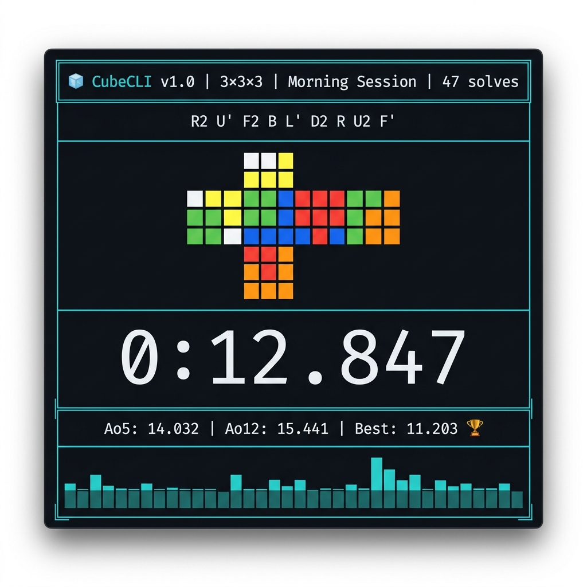

<div align="center">



# 🧊 CubeCLI

**A professional Rubik's Cube speedcubing timer for your terminal.**

[](https://python.org)
[](LICENSE)
[](https://pypi.org/project/cubecli)
[](https://github.com/Axzo001/CubeCLI/actions)
[](https://github.com/astral-sh/ruff)
[](CONTRIBUTING.md)

*WCA-compliant scrambles · ANSI cube color preview · Braille progress charts · OLL/PLL trainer · Full stats engine*

[Installation](#-installation) · [Quick Start](#-quick-start) · [Features](#-features) · [Screenshots](#-screenshots) · [Contributing](#-contributing)

</div>

---

## ✨ Why CubeCLI?

Most speedcubing timers live in your browser. CubeCLI lives in your terminal — where it belongs.

- **Zero browser required** — 100% offline, keyboard-driven, distraction-free
- **The only CLI timer** with a real-time ANSI color cube preview showing your exact scramble state
- **WCA-equivalent scrambles** powered by the same engine that drives csTimer
- **Data you own** — stored locally in SQLite, exportable to CSV/JSON anytime
- **Deep analytics** — sparklines, braille charts, heatmaps, CFOP split tracking

---

## 📦 Installation

**Requirements:** Python 3.11+

```bash
pip install cubecli
```

Or install from source (recommended for development):

```bash
git clone https://github.com/Axzo001/CubeCLI.git
cd CubeCLI
pip install -e ".[dev]"
```

---

## 🚀 Quick Start

```bash
# Launch the timer (3x3 by default)
cubecli

# Start with a specific puzzle
cubecli --puzzle 2x2
cubecli --puzzle pyraminx

# Open the stats dashboard
cubecli stats

# Open the OLL/PLL trainer
cubecli train --set OLL

# Generate and print scrambles
cubecli scramble --count 10 --puzzle 3x3

# Import from csTimer
cubecli import --from cstimer --file export.json
```

---

## 🎯 Features

### ⏱️ Timer
| Feature | Details |
|---|---|
| **Stackmat-style input** | Hold `SPACE` ≥ 0.5s → green light → release to start |
| **Precision** | Microsecond accuracy via `time.perf_counter()` |
| **WCA Inspection** | Configurable 15s countdown with audio warnings at 8s and 12s |
| **Penalties** | `+2`, `DNF`, delete, undo delete |
| **Multi-phase** | CFOP split timing: tap `SPACE` after Cross → F2L → OLL → PLL |
| **BLD mode** | Separate Memo + Execution timers |
| **Manual entry** | Type a time directly with `m` |

### 🔀 Scrambles
| Feature | Details |
|---|---|
| **Library** | [`pyTwistyScrambler`](https://github.com/euphwes/pyTwistyScrambler) — wraps csTimer's JS engine |
| **Events** | All 17 WCA events: 2x2, 3x3, 4x4, 5x5, 6x6, 7x7, Pyraminx, Megaminx, Skewb, Square-1, Clock, FTO + BLD variants |
| **Training** | OLL (57), PLL (21), F2L (41), ZBLL subset filters |
| **Utilities** | Copy to clipboard, view history, batch print |

### 🎨 Cube Color Preview
Real-time ANSI 2D net — the scrambled cube state rendered with colored blocks:
```
        ┌───┐
        │ W │   ← U face (White)
    ┌───┼───┼───┬───┐
    │ O │ G │ R │ B │   ← L F R B
    └───┼───┼───┴───┘
        │ Y │   ← D face (Yellow)
        └───┘
```
Each sticker is rendered as `██` with WCA-standard ANSI background colors.

### 📊 Statistics
- **Averages:** Mo3, Ao5, Ao12, Ao50, Ao100, Ao1000
- **Records:** Session best, all-time best per puzzle, best Ao5/Ao12/Ao50/Ao100
- **Advanced:** Standard deviation, consistency score, sub-X count, PB streaks
- **CFOP splits:** Average Cross, F2L, OLL, PLL times (with multi-phase mode)

### 📈 Terminal Charts
- **Sparkline** — inline last-12-solves bar chart: `▁▂▃▄▃▂▁▃▅▄▂▃`
- **Full line chart** — solve times + Ao5/Ao12 trend overlays (braille-resolution via `textual-plot`)
- **Distribution histogram** — solve time bucketing
- **Heatmap calendar** — GitHub-contribution-style daily solve frequency
- **CFOP split bar chart** — compare phase averages

### 🎓 Training Mode
- **OLL Trainer** — all 57 cases with name, ASCII diagram, algorithm
- **PLL Trainer** — all 21 cases
- **F2L Trainer** — 41 cases
- **Case picker** — select specific cases to drill
- **Spaced repetition** — harder cases appear more often
- **Per-case stats** — track your average for every case individually

### 💾 Data Management
- **Storage:** SQLite (`~/.cubecli/solves.db`) with daily JSON backup
- **Import:** csTimer JSON, TwistyTimer CSV, CubeDesk JSON, NexusTimer
- **Export:** CSV, JSON
- **Sessions:** Create, rename, split, merge, delete

---

## 📸 Screenshots

<table>
  <tr>
    <td align="center"><b>Main Timer</b></td>
    <td align="center"><b>Stats Dashboard</b></td>
  </tr>
  <tr>
    <td></td>
    <td></td>
  </tr>
  <tr>
    <td align="center"><b>OLL Trainer</b></td>
    <td align="center"><b>Progress Chart</b></td>
  </tr>
  <tr>
    <td></td>
    <td></td>
  </tr>
</table>

---

## ⌨️ Keyboard Reference

| Key | Action |
|---|---|
| `SPACE` | Hold to ready → release to start/stop |
| `d` | Mark DNF |
| `p` / `+` | Add +2 penalty |
| `r` | New scramble |
| `c` | Copy scramble to clipboard |
| `v` | Toggle cube preview |
| `Del` | Delete last solve |
| `z` | Undo delete |
| `m` | Manual time entry |
| `n` | Add note to last solve |
| `s` | Full stats screen |
| `g` | Full graph screen |
| `S` | Session manager |
| `P` | Puzzle picker |
| `T` | Training mode |
| `i` | Toggle inspection countdown |
| `M` | Metronome settings |
| `e` | Export session to CSV |
| `I` | Import solves |
| `?` | Help overlay |
| `q` | Quit |

---

## 📂 Project Structure

```
CubeCLI/
├── cubecli/
│   ├── core/
│   │   ├── timer.py          # Timer logic, precision timing
│   │   ├── scramble.py       # Scramble generation (pyTwistyScrambler)
│   │   ├── cube.py           # 3x3 state simulator (for preview)
│   │   └── stats.py          # Statistics engine (Ao5, Ao12, PB, etc.)
│   ├── ui/
│   │   ├── app.py            # Main Textual app
│   │   ├── timer_screen.py   # Main timer TUI screen
│   │   ├── stats_screen.py   # Statistics dashboard screen
│   │   ├── graph_screen.py   # Chart/graph screen
│   │   ├── session_screen.py # Session manager screen
│   │   ├── help_screen.py    # Help overlay
│   │   └── widgets/
│   │       ├── cube_preview.py   # ANSI cube net widget
│   │       ├── timer_display.py  # Big digit timer widget
│   │       ├── sparkline.py      # Inline sparkline widget
│   │       └── stats_panel.py    # Stats sidebar widget
│   ├── training/
│   │   ├── trainer.py        # Training mode logic
│   │   ├── cases.py          # OLL/PLL case loader
│   │   └── data/
│   │       ├── oll.json      # 57 OLL cases with algorithms
│   │       ├── pll.json      # 21 PLL cases with algorithms
│   │       └── f2l.json      # 41 F2L cases
│   ├── data/
│   │   ├── db.py             # SQLite database interface
│   │   ├── session.py        # Session model + CRUD
│   │   ├── solve.py          # Solve model + CRUD
│   │   └── importer.py       # Import from csTimer, TwistyTimer, etc.
│   ├── config.py             # Config loader (~/.cubecli/config.json)
│   └── __init__.py
├── tests/
│   ├── test_timer.py
│   ├── test_scramble.py
│   ├── test_stats.py
│   └── test_cube.py
├── assets/
│   └── preview.png
├── docs/
│   ├── FEATURES.md
│   └── KEYBOARD.md
├── .github/
│   ├── ISSUE_TEMPLATE/
│   │   ├── bug_report.md
│   │   └── feature_request.md
│   ├── workflows/
│   │   └── ci.yml
│   └── PULL_REQUEST_TEMPLATE.md
├── CHANGELOG.md
├── CODE_OF_CONDUCT.md
├── CONTRIBUTING.md
├── LICENSE
├── pyproject.toml
└── README.md
```

---

## 🛠️ Tech Stack

| Component | Library | Why |
|---|---|---|
| TUI Framework | [Textual](https://github.com/Textualize/textual) | `on_key`/`on_key_release` for hold-to-start, async, modern |
| Styling/Rendering | [Rich](https://github.com/Textualize/rich) | Panels, tables, sparklines, markup |
| Scramble Generation | [pyTwistyScrambler](https://github.com/euphwes/pyTwistyScrambler) | csTimer-source, WCA-equivalent, all puzzles |
| Charts | [textual-plot](https://github.com/davidfokkema/textual-plot) | Braille-resolution line/bar charts in TUI |
| Cube Solving | [kociemba](https://github.com/hkociemba/RubiksCube-TwophaseSolver) | Solve hint + state validation |
| Storage | SQLite (stdlib) | Fast queries, no server needed |
| Clipboard | [pyperclip](https://github.com/asweigart/pyperclip) | Cross-platform scramble copy |
| Audio | [beepy](https://github.com/MaxStrange/beepy) | Inspection beeps, metronome |

---

## 🤝 Contributing

Contributions are welcome! Please read [CONTRIBUTING.md](CONTRIBUTING.md) for guidelines.

Quick start for contributors:

```bash
git clone https://github.com/Axzo001/CubeCLI.git
cd CubeCLI
pip install -e ".[dev]"
pre-commit install
pytest tests/
```

See [CONTRIBUTING.md](CONTRIBUTING.md) for a detailed guide on:
- Setting up your dev environment
- Code style (Ruff + Black)
- Writing tests
- Submitting pull requests

---

## 🗺️ Roadmap

- [x] Project scaffold & GitHub setup
- [x] Phase 1: Core timer + scrambles + basic stats
- [x] Phase 2: ANSI cube color preview
- [/] Phase 3: Advanced stats + braille charts
- [ ] Phase 4: OLL/PLL training mode
- [ ] Phase 5: Multi-puzzle + BLD mode + metronome
- [ ] Phase 6: Import/export + theme system
- [ ] Phase 7: Smart cube Bluetooth (GAN/MoYu)

Track progress on the [Projects board](https://github.com/Axzo001/CubeCLI/projects).

---

## 📄 License

MIT License — see [LICENSE](LICENSE) for details.

---

## 🙏 Acknowledgements

- [pyTwistyScrambler](https://github.com/euphwes/pyTwistyScrambler) — scramble generation
- [csTimer](https://github.com/cs0x7f/cstimer) — scramble algorithm source & inspiration
- [Textual](https://github.com/Textualize/textual) — the TUI framework that makes this possible
- [cubing.js](https://github.com/cubing/cubing.js) — protocol reference for smart cube integration
- The WCA speedcubing community ❤️

---

<div align="center">
Made with ❤️ for speedcubers who live in the terminal.
<br><br>
<b>⭐ Star this repo if CubeCLI helps your training!</b>
</div>
